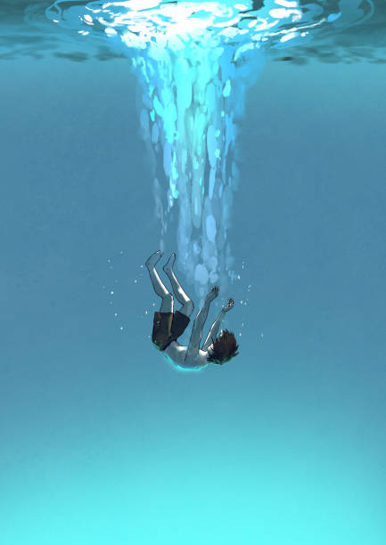
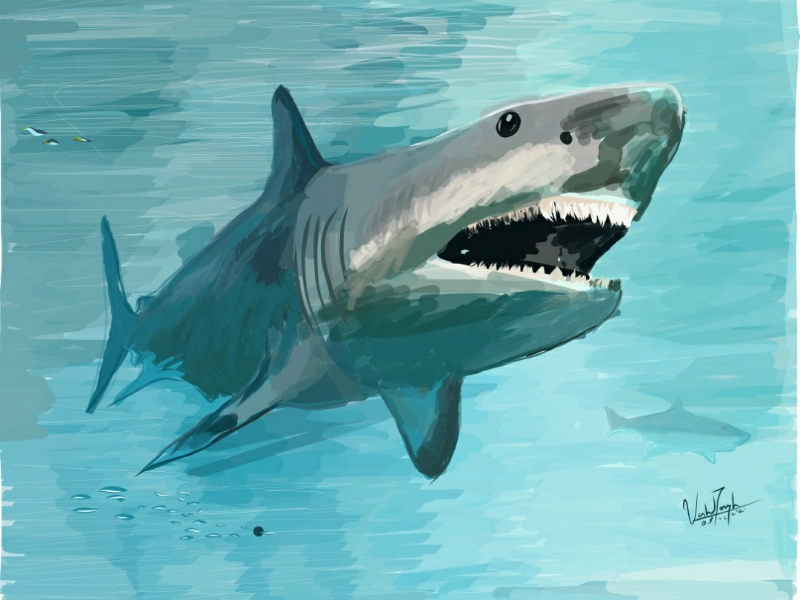
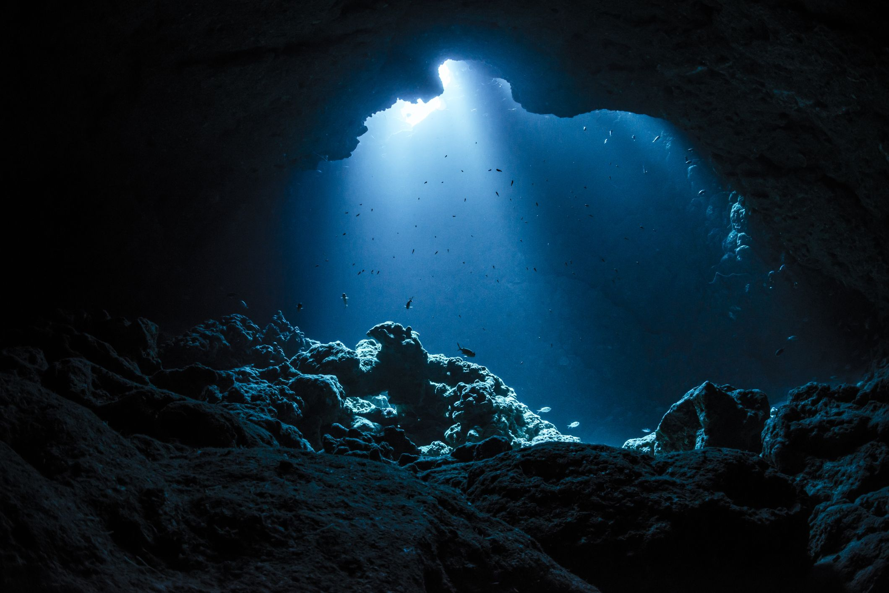

# My Greatest Fear

## Who am I and what is my Greatest Fear?
Hello, my name is Danny and my greatest fear is the great and vast ocean.
## Why?
- I cannot swim and would probably drown in the ocean.

- There are things that could kill me such as sharks.

- We, as a society, have barely explored the ocean at all.

## Things to do to get over my fear
To get other my fear of the ocean, I could buy a [lifejacket](https://www.canadiantire.ca/en/pdp/fluid-universal-three-belt-pfd-life-jacket-yellow-0791900p.html?loc=plp), learn how to swim, interact with sharks, and explore the ocean myself with sucba gear or in a submarine.

## The End
Thank you for reading up on my fears, I also have other fears but this is my number one that freaks me out the most.
